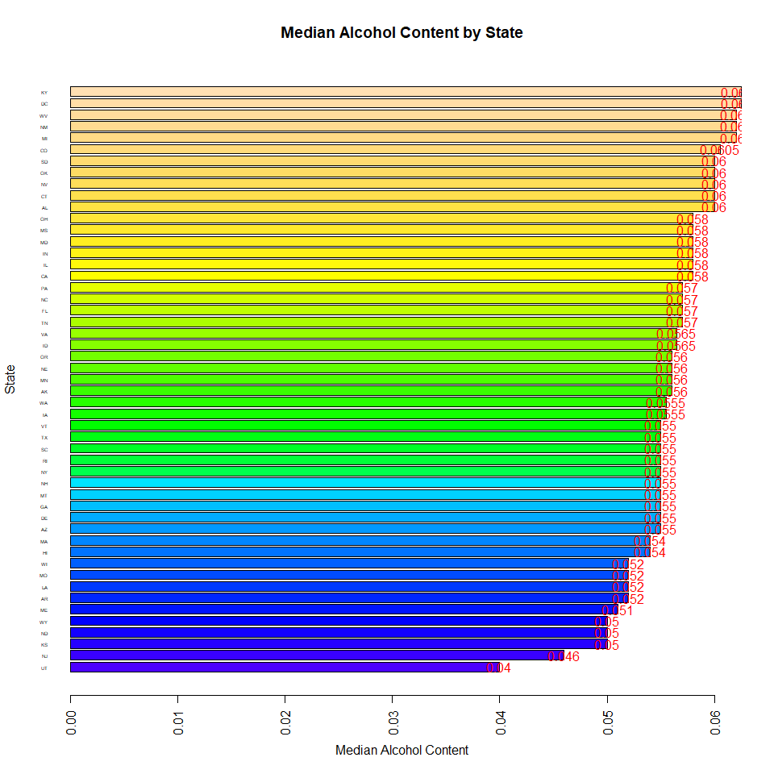
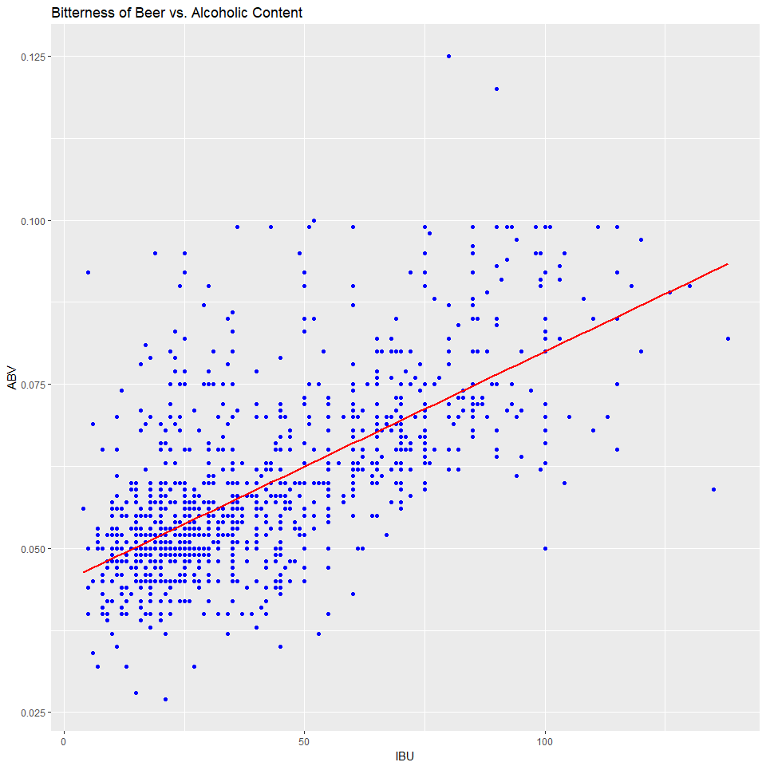

Source Documents
----------------

``` r
## Saved the csv documents on GitHub, the code below process information from GitHub instead of our local computers.

require(RCurl)
```

    Loading required package: RCurl

    Warning: package 'RCurl' was built under R version 3.4.3

    Loading required package: bitops

``` r
## Reading from beers csv. The csv is saved on GitHub

Beers <- data.frame(read.csv(text = getURL("https://raw.githubusercontent.com/jfzjonathan/casestudy1/master/Beers.csv"),header = TRUE,sep=","))

## Reading from breweries csv. The csv is saved on GitHub

Breweries <- data.frame(read.csv(text = getURL("https://raw.githubusercontent.com/jfzjonathan/casestudy1/master/Breweries.csv"),header = TRUE,sep=","))
```

Making the raw data tidy data
-----------------------------

``` r
## Renaming Beer columns

colnames(Beers) <- c("BeerName", "BeerID", "ABV", "IBU", "BreweryID","BeerStyle", "Ounces")


## Renaming Breweries columns

colnames(Breweries) <- c("BreweryID", "BreweryName", "BreweryCity", "BreweryState")
```

``` r
## Displaying the first rows of Beer to make sure they transfer properly


library(knitr)
```

    ## Warning: package 'knitr' was built under R version 3.4.3

``` r
knitr::kable(head(Beers))
```

| BeerName            |  BeerID|    ABV|  IBU|  BreweryID| BeerStyle                      |  Ounces|
|:--------------------|-------:|------:|----:|----------:|:-------------------------------|-------:|
| Pub Beer            |    1436|  0.050|   NA|        409| American Pale Lager            |      12|
| Devil's Cup         |    2265|  0.066|   NA|        178| American Pale Ale (APA)        |      12|
| Rise of the Phoenix |    2264|  0.071|   NA|        178| American IPA                   |      12|
| Sinister            |    2263|  0.090|   NA|        178| American Double / Imperial IPA |      12|
| Sex and Candy       |    2262|  0.075|   NA|        178| American IPA                   |      12|
| Black Exodus        |    2261|  0.077|   NA|        178| Oatmeal Stout                  |      12|

``` r
## Displaying the first rows of Breweries to make sure they transfer properly


knitr::kable(head(Breweries))
```

|  BreweryID| BreweryName               | BreweryCity   | BreweryState |
|----------:|:--------------------------|:--------------|:-------------|
|          1| NorthGate Brewing         | Minneapolis   | MN           |
|          2| Against the Grain Brewery | Louisville    | KY           |
|          3| Jack's Abby Craft Lagers  | Framingham    | MA           |
|          4| Mike Hess Brewing Company | San Diego     | CA           |
|          5| Fort Point Beer Company   | San Francisco | CA           |
|          6| COAST Brewing Company     | Charleston    | SC           |

1. How many breweries are present in each state?
------------------------------------------------

``` r
## Displaing table with States (two letter) and the number of Breweries per State

kable(data.frame(table(Breweries$BreweryState)),col.names=c("State","Number of Breweries"))
```

| State |  Number of Breweries|
|:------|--------------------:|
| AK    |                    7|
| AL    |                    3|
| AR    |                    2|
| AZ    |                   11|
| CA    |                   39|
| CO    |                   47|
| CT    |                    8|
| DC    |                    1|
| DE    |                    2|
| FL    |                   15|
| GA    |                    7|
| HI    |                    4|
| IA    |                    5|
| ID    |                    5|
| IL    |                   18|
| IN    |                   22|
| KS    |                    3|
| KY    |                    4|
| LA    |                    5|
| MA    |                   23|
| MD    |                    7|
| ME    |                    9|
| MI    |                   32|
| MN    |                   12|
| MO    |                    9|
| MS    |                    2|
| MT    |                    9|
| NC    |                   19|
| ND    |                    1|
| NE    |                    5|
| NH    |                    3|
| NJ    |                    3|
| NM    |                    4|
| NV    |                    2|
| NY    |                   16|
| OH    |                   15|
| OK    |                    6|
| OR    |                   29|
| PA    |                   25|
| RI    |                    5|
| SC    |                    4|
| SD    |                    1|
| TN    |                    3|
| TX    |                   28|
| UT    |                    4|
| VA    |                   16|
| VT    |                   10|
| WA    |                   23|
| WI    |                   20|
| WV    |                    1|
| WY    |                    4|

2. Merge beer data with the breweries data. Print the first 6 observations and the last six observations to check the merged file.
----------------------------------------------------------------------------------------------------------------------------------

``` r
## Mergin dataframe Brewwries and Beers by "BreweryID" and assinging to object BeerBreweries

BeerBreweries <- merge(Beers, Breweries, by="BreweryID")

## Displaying table with first 6 and last 6 observertions of the merged file.

knitr::kable(rbind(head(BeerBreweries),tail(BeerBreweries)))  
```

|      |  BreweryID| BeerName                  |  BeerID|    ABV|  IBU| BeerStyle                           |  Ounces| BreweryName                   | BreweryCity   | BreweryState |
|------|----------:|:--------------------------|-------:|------:|----:|:------------------------------------|-------:|:------------------------------|:--------------|:-------------|
| 1    |          1| Get Together              |    2692|  0.045|   50| American IPA                        |      16| NorthGate Brewing             | Minneapolis   | MN           |
| 2    |          1| Maggie's Leap             |    2691|  0.049|   26| Milk / Sweet Stout                  |      16| NorthGate Brewing             | Minneapolis   | MN           |
| 3    |          1| Wall's End                |    2690|  0.048|   19| English Brown Ale                   |      16| NorthGate Brewing             | Minneapolis   | MN           |
| 4    |          1| Pumpion                   |    2689|  0.060|   38| Pumpkin Ale                         |      16| NorthGate Brewing             | Minneapolis   | MN           |
| 5    |          1| Stronghold                |    2688|  0.060|   25| American Porter                     |      16| NorthGate Brewing             | Minneapolis   | MN           |
| 6    |          1| Parapet ESB               |    2687|  0.056|   47| Extra Special / Strong Bitter (ESB) |      16| NorthGate Brewing             | Minneapolis   | MN           |
| 2405 |        556| Pilsner Ukiah             |      98|  0.055|   NA| German Pilsener                     |      12| Ukiah Brewing Company         | Ukiah         | CA           |
| 2406 |        557| Heinnieweisse Weissebier  |      52|  0.049|   NA| Hefeweizen                          |      12| Butternuts Beer and Ale       | Garrattsville | NY           |
| 2407 |        557| Snapperhead IPA           |      51|  0.068|   NA| American IPA                        |      12| Butternuts Beer and Ale       | Garrattsville | NY           |
| 2408 |        557| Moo Thunder Stout         |      50|  0.049|   NA| Milk / Sweet Stout                  |      12| Butternuts Beer and Ale       | Garrattsville | NY           |
| 2409 |        557| Porkslap Pale Ale         |      49|  0.043|   NA| American Pale Ale (APA)             |      12| Butternuts Beer and Ale       | Garrattsville | NY           |
| 2410 |        558| Urban Wilderness Pale Ale |      30|  0.049|   NA| English Pale Ale                    |      12| Sleeping Lady Brewing Company | Anchorage     | AK           |

3. Report the number of NA's in each column.
--------------------------------------------

``` r
## Displaying table with columns and the number of NA's on each column

kable(sapply(data.frame(sapply(BeerBreweries, is.na)),sum),col.names="Number of NA's")
```

|              |  Number of NA's|
|--------------|---------------:|
| BreweryID    |               0|
| BeerName     |               0|
| BeerID       |               0|
| ABV          |              62|
| IBU          |            1005|
| BeerStyle    |               0|
| Ounces       |               0|
| BreweryName  |               0|
| BreweryCity  |               0|
| BreweryState |               0|

4. Compute the median alcohol content and international bitterness unit for each state. Plot a bar chart to compare.
--------------------------------------------------------------------------------------------------------------------

``` r
## Tidying data for ABV
## 1st, eliminate rows with NA's in ABV

ABVwoNA <- BeerBreweries[-which(is.na(BeerBreweries$ABV)),]

## Calculate median alcohol content by state and assign to object ABVbyState, create 

ABVbyState <- tapply(ABVwoNA$ABV, ABVwoNA$BreweryState, median)

## Displying bar char of median alcohol content by state

par(las=2)
abv_bar <- barplot(sort(ABVbyState), main="Median Alcohol Content by State", horiz=TRUE, xlab="Median Alcohol Content", ylab="State", cex.names=0.4, col=topo.colors(nrow(ABVbyState)))
text(y = abv_bar, x=sort(ABVbyState), label=sort(ABVbyState), col="red")
```



``` r
## Tidying data for IBU
## 1st, eliminate rows with NA's in IBU

IBUwoNA <- BeerBreweries[-which(is.na(BeerBreweries$IBU)),]

## Calculate international bitterness unit content by state and assign to object IBUbyState

IBUbyState <- tapply(IBUwoNA$IBU, IBUwoNA$BreweryState, median)


## Displying bar char of international bitternes unit by state

par(las=2)
ibu_bar <- barplot(sort(IBUbyState), main="Median International Bitteness Unit by State", horiz=TRUE, xlab="Median International Bitterness Unit", ylab="State", cex.names=0.4, col=topo.colors(nrow(IBUbyState)))
text(y = ibu_bar, x=sort(IBUbyState), label=sort(IBUbyState), col="red")
```


5. Which state has the maximum alcoholic (ABV) beer? Which state has the most bitter (IBU) beer?
------------------------------------------------------------------------------------------------

#### The states with the maximun alcoholic beer are

``` r
## Display which state has the maximun ABV beer

cat(as.character(ABVwoNA[which(ABVwoNA$ABV==max(ABVwoNA$ABV)),"BreweryState"]))
```

CO

#### and the state with the most bitter beer is

``` r
## Display which state has the maximun IBU beer

cat(as.character(IBUwoNA[which(IBUwoNA$IBU==max(IBUwoNA$IBU)),"BreweryState"]))
```

OR

6. Summary statistics for the ABV variable.
-------------------------------------------

``` r
##Generate statical sumamry for the ABV variable

kable(rbind(summary(ABVwoNA$ABV)))
```

|   Min.|  1st Qu.|  Median|       Mean|  3rd Qu.|   Max.|
|------:|--------:|-------:|----------:|--------:|------:|
|  0.001|     0.05|   0.056|  0.0597734|    0.067|  0.128|

7. Is there an apparent relationship between the bitterness of the beer and its alcoholic content? Draw a scatter plot.
-----------------------------------------------------------------------------------------------------------------------

#### As can be observed in the figure below...

``` r
## Tidying up BeerBrewery data frame

BBnoNA <- ABVwoNA[-which(is.na(ABVwoNA$IBU)),]

## Loading ggplot2 to draw graphics

library(ggplot2)
```

    ## Warning: package 'ggplot2' was built under R version 3.4.3

``` r
## Displaying IBU vs. ABV scatter plot

ggplot(BBnoNA, aes(x=IBU,y=ABV))+geom_point()+ggtitle("Bitterness of Beer vs. Alcoholic Content")
```



``` r
## Scatter Plot Analysis
##
## The scatter plots indicate a positive direct relationship between IBU and ABV.  The simple linear regression can be made.
##
## ------------------------------------------------------------------------------------------------------------------------
```
